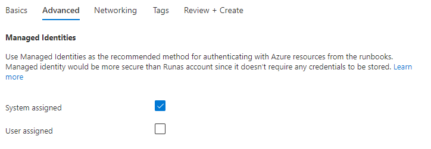
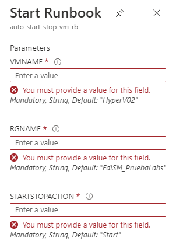
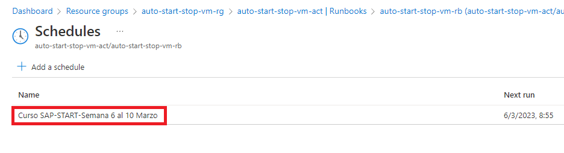

# AzureStartStopVMs
Configuración de la automatización para programar el inicio y el apagado de VMs.

## 1. Configuración de VSC para trabajar con Azure Automation.

Como podrás ver, trabajar con un script de PowerShell directamente en la página web de Azure, editándolo desde el Runbook es impracticable, entre otras cosas porque no ofrece intelliSense. Por lo tanto usaremos VSC e instalaremos el plugin de Automatización. 

En el panel izquierdo de VSC, seleccionamos las extensiones (podemos usar la combinacion ***CTRL+SHIFT+X***)

En el cuadro de búsqueda escribimos...
```
Azure automation
```

El la imagen puedes ver como aparece la extensión.


Procedemos a su instalación haciendo clic en el botón ***Install*** de la extensión.

Usaremos VSC en breve.

## 2. Creación del grupo de recursos.

Creamos un grupo de recursos para mantener juntos todos los recursos relacionados con la automatización, que son los siguientes:

* Cuenta de automatización.
* Runbook

Para ello creamos en Azure un grupo de recursos en la subscripción ***Ecosistema de aprendizaje***, con la siguiente configuración.


## 3. Creación de la cuenta de automatización y asignación de rol.

Procedemos a crear una ***cuenta de automatización*** (Automation Accounts) de Azure en el grupo de recursos anterior, configurándola de la siguiente manera, en la pestaña ***Basics*** debemos poner...


Hacemos clic para acceder a la pestaña ***Advanced***, donde debemos indicar la identidad con la que se presentará esta cuenta de automatización. Como las identidades tipo ***Run As Account*** ya no se pueden usar en Azure, debemos elegir una identidad ***Asignada por el sistema*** (System Assigned)



Avanzamos hasta ***Networking***, donde elegimos ***Public Access***, ya que no hay integración con la red on-prem.


Hacemos clic en el botón ***Review + Create***. Cuando la verificación haya sido correcta, hacemos clic en ***Create*** y esperamos a que se cree la cuenta de automatización y accedemos al recurso.

Ahora necesitamos asignar permisos,  en un ámbito de Azure, a la identidad administrada que ha creado la cuenta de automatización. Esto se hace por medio de la opción ***Identity*** del grupo ***Account Settings***, tal y como se muestra en la imagen.


Hacemos clic en el botón ***Azure Role Assignments***.


Con la suscripción ***Ecosistema de aprendizaje*** seleccionada, hacemos clic en ***Add role Assignment***.


Asignamos el rol ***Contributor*** en el ámbito de la suscripción ***Ecosistema de aprendizaje***, y hacemos clic en el botón ***Save***.


A partir de ahora, la identidad administrada asociada a esta cuenta de automatización tendrá el rol de contribuidor en la suscripción, por lo que será capaz de iniciar y detener VMs.


## 4. Verificar la conexión de VSC con la cuenta de automatización recién creada.

Volvemos a VSC. En el menú lateral izquierdo, hacemos clic en el icono de Azure. También se puede conseguir con ***SHIFT+ALT+A***.


En la sección ***Azure Automation***, desplegamos la subscripción ***Ecosistema de apredizaje***, y en ella, la cuenta de automatización recién creada. Podremos ver los componentes de dicha cuenta de automatización.


A partir de ahora podemos crear los componentes desde VSC o desde la Interfaz de Azure.

## 5. Creación del runbook

Creamos un runbook para iniciar/detener las VMs. Para ello, desde la interfaz de Azure, y dentro de la cuenta de automatización, hacemos clic en el botón ***Create a runbook***.


El runbook lo configuramos de la siguiente forma...


Hacemos clic en el botón ***Create*** y esperamos a que termine su creación.

Aparecerá el editor del runbook, con una interfaz muy pobre, así que vamos a programarlo desde VSC.

## 6. Edición del código fuente del runbook desde VSC.

De vuelta en VSC, en el panel izquierdo debemos ver ya el runbook creado desde la interfaz gráfica de Azure.


Esto permitirá usar toda la potencia de este editor. El contenido del runbook es el siguiente...
```
Param (
    [Parameter (Mandatory = $true)] [String] $vmName = "HyperV02",
    [Parameter (Mandatory = $true)] [String] $rgName = "FdlSM_PruebaLabs",
    [Parameter (Mandatory = $true)] [String] $startStopAction = "Start"
)

function doUntilCondition {
    param(
        [Parameter(Mandatory = $true, Position = 0)] [String]$vm,
        [Parameter(Mandatory = $true, Position = 1)] [String]$rg,  
        [Parameter(Mandatory = $true, Position = 2)] [String]$powerState
    )

    # Inicializo el estado de aprovisionamiento.
    $lastProvisioningState = ""

    # Tomo el estado de aprovisionamiento de la VM.
    $provisioningState = (Get-AzVM -name $vm -resourcegroupname $rg -Status).Statuses[1].Code
    
    # Determino la condición de salida del bucle infinito.
    $condition = ($provisioningState -eq $powerState)
    
    # Iteramos hasta que la VM esté en ejecución.
    while (!$condition) {
        if ($lastProvisioningState -ne $provisioningState) {
            write-host "$vm en el grupo de recursos $rg tiene el estado $provisioningState (Esperando a que cambie el estado)"
        }
        $lastProvisioningState = $provisioningState
 
        # Esperamos para actualizar.
        Start-Sleep -Seconds 5

        # Actualizamos estado.
        $provisioningState = (Get-AzVM -name $vm -resourcegroupname $rg -Status).Statuses[1].Code
 
        # Actualizamos condición de salida del bucle.
        $condition = ($provisioningState -eq $powerState)
    }

    # La VM ha alcanzado el estado deseado.
    Write-Output "$vm en el grupo de recursos $rg tiene el estado $provisioningState" -ForegroundColor Green
}


# Programa principal.

Write-Output "Conectando a Azure mediante el comando Connect-AzAccount -Identity"

Connect-AzAccount -Identity 

Write-Output "Conectado por medio de la identidad administrada de la cuenta de automatización."

# Compruebo si la VM existe.
Get-AzVM -Name $vmName -ResourceGroupName $rgName -ErrorVariable notPresent -ErrorAction SilentlyContinue

if ($notPresent) {
    Write-Output "No se ha encontrado la VM $vmName en el grupo de recursos $rgName. Finalizando script"
    
    # Esperamos unos segundos para que terminen de llegar los eventos asíncronos antes de...
    Start-Sleep -Seconds 10

    # Lanzar una excepción para que finalice el script.
    throw "VM no encontrada"
}


if ($startStopAction -eq "Start") {
    Write-Output "Iniciando la VM $vmName del grupo de recursos $rgName"

    # Inicio la VM y no espero.
    Start-AzVM -Name $vmName -ResourceGroupName $rgName -noWait

    # Espero hasta que la VM se haya iniciado.
    doUntilCondition -vm $vmName -rg $rgName -powerState "PowerState/running"
}
elseif ($startStopAction -eq "Stop") {
    Write-Output "Deteniendo la VM $vmName del grupo de recursos $rgName"

    $ProgressPreference = "SilentlyContinue"

    # Detengo la VM y no espero. 
    # Importante poner "Force" porque el script falla esperando la confirmación del usuario al no poder leer la entrada estándar.
    Stop-AzVM -Name $vmName -ResourceGroupName $rgName -noWait -Force

    # Espero hasta que la VM se haya detenido.
    doUntilCondition -vm $vmName -rg $rgName -powerState "PowerState/deallocated"
}
else {
    # La acción es incorrecta.
    Write-Output "La acción" $startStopAction "no se puede procesar."
}
```

Copialo y pégalo en VSC. A continuación lo guardamos con ***CTRL+S***.

El runbook lo tenemos en local. Para subirlo a Azure hay que publicarlo. Para ello, hacemos clic ***con el botón derecho***, en el nombre del runbook que tenemos en el panel izquierdo. Aparecerá un menú contextual en el que debemos seleccionar la opción ***Publish Runbook***.

VSC pedirá permiso para la publicación. Hacemos clic en ***Yes***


Cuando se haya subido, VSC mostrará un mensaje en la parte inferior derecha de su ventana.


Es el momento de comprobar el resultado en la web de Azure. Hacemos clic en en link del runbook...


Aquí veremos dos botones. El botón ***View*** permitirá en forma de solo lectura el código del runbook, mientras que ***Edit*** permitirá editarlo. Esto último no lo recomendamos y aconsejamos hacerlo en VSC, para posteriormente publicarlo.


## 7. Ejecución manual del runbook.

Para ejecutarlo hacemos clic en el botón ***Start***.

Como el runbook tiene parámetros, habrá que rellerarlos. Todos los campos son obligatorios. 

* ***VMNAME***: Es el nombre de la VM.
* ***RGNAME***: Es el nombre del grupo de recursos que tiene la VM.
* ***STARTSTOPACTION***: Debe ser ***Start*** o ***Stop***. No se admite ningún otro valor.



A modo de ejemplo iniciamos con el parámetro ***Start*** la VM ***HyperV02*** ubicada en el grupo de recursos ***FdlSM_PruebaLabs***. Hacemos clic el el botón ***OK***.


Se creará un trabajo para ejecutar el script de PowerShell del runbook, tal y como puede apreciarse en la siguiente imagen.
(Nota: Observa que en la pestaña ***input*** se muestran los parámetros de entrada al script.)


El resto de pestañas (***Output***, ***Errors***, ***Warnings***, ***All Logs***, ***Exception***), destacamos las dos siguientes:

* ***Errors***: Mostrará si el script tiene errores y se usa en la fase de depuración.
* ***All Logs***: Visualiza la salida estándar de la ejecución del script. Es importante observar que los resultados obtenidos pueden no verse en el orden correcto, ya que la ejecución es asíncrona, y unos resultados pueden venir antes que otros.

Si seleccionamos la pestaña ***All Logs*** podremos ver todo lo que hace el script. Es muy importante observar que no produce errores ni avisos.


Pasado un rato, comprobamos que la VM se ha iniciado correctamente.


Para apagar la VM, procedemos a ejecutar el runbook, pasando el parámetro ***Stop***. Procedemos a apagarla.


## 8. Crear planificación de encendio/apagado de la VM.

La planificación (schedule) nos permite ejecutar un runbook en el momento que deseemos (con la periodicidad deseada.) Para crear una entramos en la planificación de la cuentas de automatización (en este caso ***auto-start-stop-vm-act***) y hacemos clic en ***Schedules***, en la sección ***Shared Resources***. Posteriormente clic en  ***Add a schedule***.


A modo de ejemplo, supongamos que un curso de SAP se debe iniciar (START) todos los días desde el 6/3/2023 hasta el 10/3/2023, a las 9:00. Teniendo en cuenta la recomendación de Azure de iniciar 5 minutos antes, podría ser así.


Hacemos clic en el botón ***Create***. Se creará la plafinicación, pero no estará asociada aún a ningun runbook. Esto se puede ver haciendo clic en la planificación recién creada.


Para asignarle un runbook hacemos clic en ***Runbooks***, en la sección ***Process Automation***.


Elegimos el runbook apropiado, en este caso ***auto-start-stop-vm-rb***.


Y le asignamos la planificación por medio de ***Link to schedule***.


Ahora debemos hacer dos cosas; En ***Schedule*** seleccionar la planificación que hemos creado antes y, en ***Parameters and run Settings*** proporcionar los parámetros para que se ejecute el runbook.


Elegimos ***Curso SAP-START-Semana 6 al 10 Marzo***.



De vuelta a la planificación del runbook, hacemos clic en ***Parameters and run Settings*** y lo configuramos así.
(Nota: Asegurar que se pone ***Start***)


Hacemos clic en ***OK*** dos veces.

Volviendo a las planificaciones de la cuenta de automatización, podremos ver ya que la planificación está asociada al runbook correcto.


Nota Importante: Habrá que crear una programación similar para detener las máquinas virtuales, para ello repetimos el procedimiento usando ***Stop*** como parámetro del runbook, el resultado sería este.


